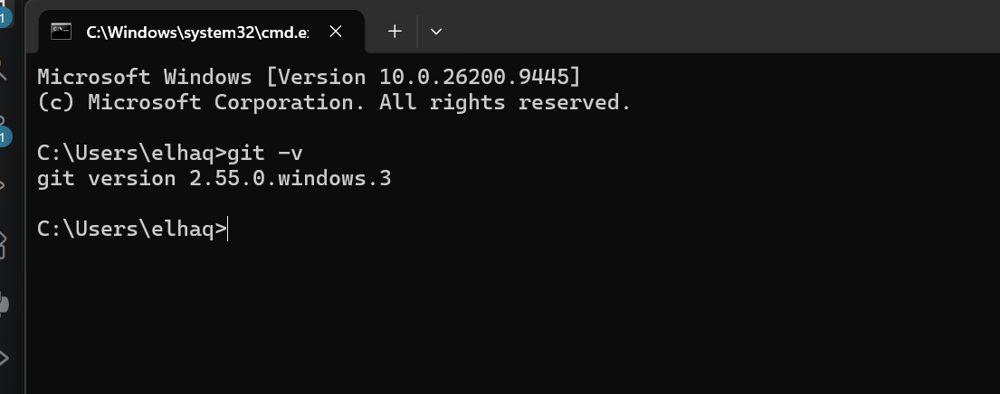
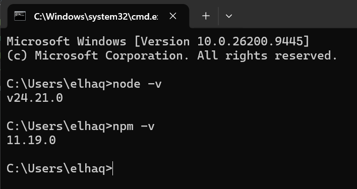
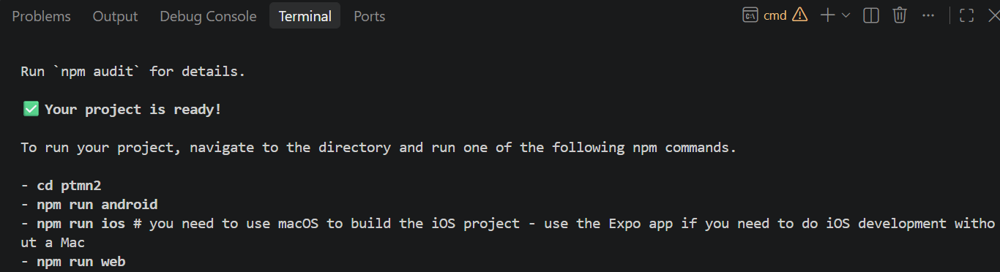
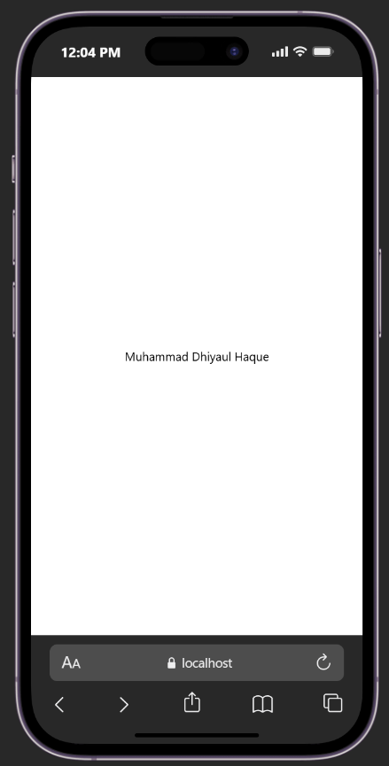

# Praktikum Menyiapkan Lingkungan Pengembangan dan Memulai Pemrograman Mobile (React Native) #

## Tujuan Pembelajaean ##
Mahasiswa mampu :
1. Menyiapkan lingkungan pengembangan dan memulai pemrograman mobile (React Native)
2. Membuat aplikasi mobile dengan React Native 
3. Menyelesaikan Tugas CV sederhana dengan React Native

## Materi dan Laporan Praktikum ##
1. Menyiapkan lingkungan pengembangan dan memulai pemrograman mobile (React Native)
 - Memastikan instalasi Git BAsh
 - Cek Instalasi Git bash (git --version)
 - bukti Verifikasi
 
 - Download dan Install NODE.JS di https://nodejs.org/en/download
 - Konfirmasi Node.JS dan NPM (node -v, npm -v)
 

2. Membuat aplikasi / Project baru dengan React Native Framework Expo  Go
 - Buka dan baca dokumentasi reai link https://docs.expo.dev/
 - Buka dan baca dokumentasi reai link https://reactnative.dev/docs/getting-started
 - Mulai Membuat projek baru
 - open terminal change directory ke Pertemuan-2
 - Masukkan perintah (npx create-expo-app ptmn2 --template blank)
 - Bukti verifikasi
 
 - Running projek 
  - CD ke ptmn2
  - npx expo start
  - Install Expo Go di Android/IOS
  - bisa juga menggunakan emulator di PC
  - berhentikan (ctrl + c)
  - install (npx expo install react-dom react-native-web)
  - npx expo start --web
  - konfirmasi Keberhasilan
    
  

