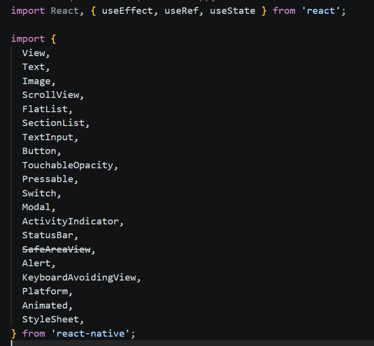
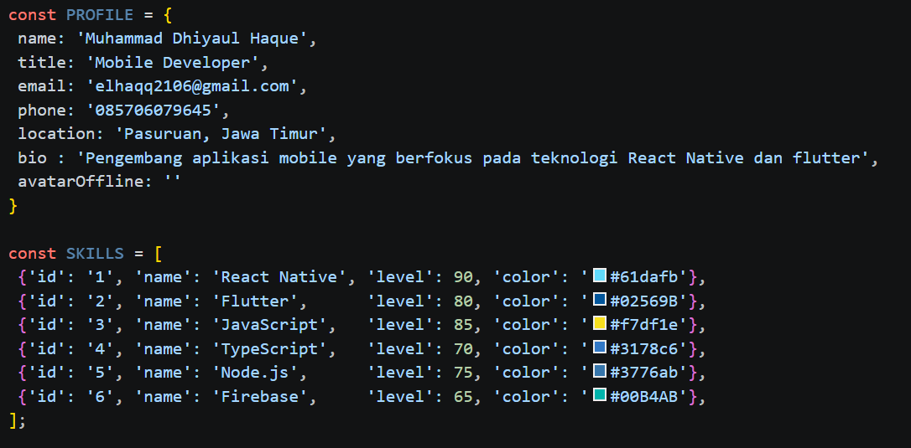
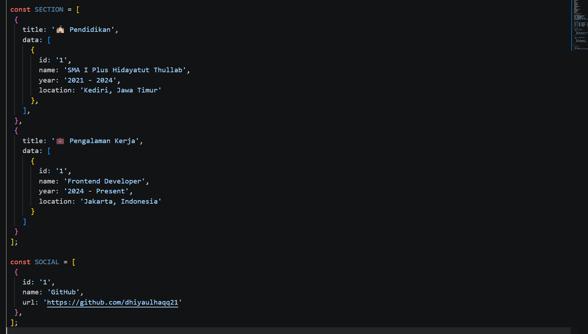

# Laporan Praktikum 3: Core Components dan Styling #

### Langkah 1: Import Library & Components ###

...
1. Buka file App.js yang ada di folder peojek ptmn2
2. Import Library dan Component yang diperlukan
3. Konfirmasi Bukti
...

### Langkah 2 : Menyiapkan Data (Objek & Array) ###

1. Menambahkan fungsi constanta PROFILE, SKIILS, SECTION, SOCIAL
2. Mengisi data PROFILE, SKIILS, SECTION, SOCIA
3. Bukti Keberhasilan

### Langkah 3: Sub-Components (SkillCard & TimelineCard) ###
