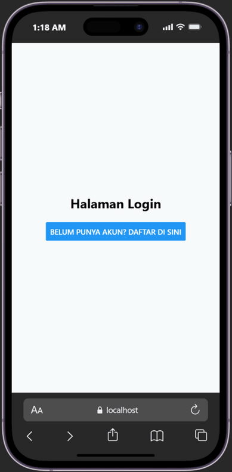
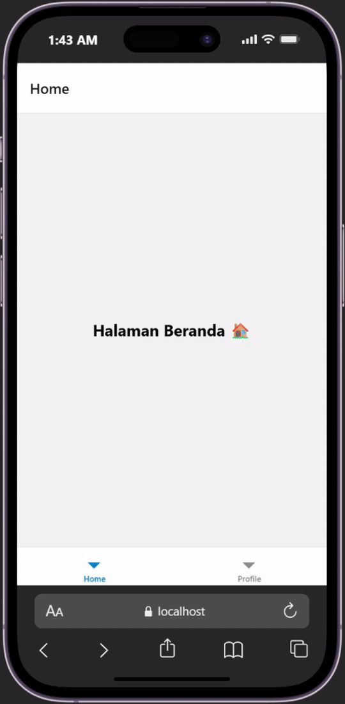
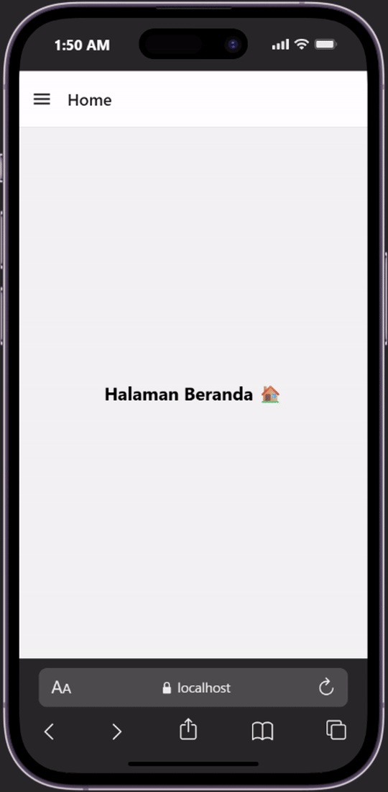

# praktikum 4: react native navigation #

## Tujuan pembelajaran ##
mahasiswa mampu: 
1. merancang dan menerapkan navigasi antar layar (screen) pada aplikasi react native
2. menggunakan library react navigation (stack navigator, tab navigator, drawer navigator)

## Alur Praktikum ##

### Langkah 1: Instalasi proyek dan instalasi depedencies React Native ###
1. Buka terminal atau comman prompt
2. ubah directori ke folder pertemuan 4(cd "Pemrograman Mobile\pertemuan-4")
3. buat proyek baaru dengan perintah: npx create-expo-app ptmn4 --template blank
4. masuk kedalam folder proyek menggunakan perintah berikut: cd ptmn4
5. Install core navigation library(npm install @react-navigation/native)

6. Install dependensi pendukung (wajib untuk Expo) npx expo install react-native-screens react-native-safe-area-context react-native-gesture-handler react-native-reanimated

### Langkah 2: membuat stack navigator ###
1. Instalasi Pustaka Stack : npm install @react-navigation/native-stack
2. buat folder didalam projek dengan nama screen
3. didalam folder screen buat 2 file dengan nama login.js dan signup.js
4. masukan kode sesuai pada module praktikum 4
5. sesuaikan file app.js dengan code pada module
6. simpan dan install depedensi untuk web "npx expo install react-dom react-native-web"
7. jalankan perintah npx expo start --web
8. konfirmasi bukti

<!-- <video src="login-register.webm" autoplay ="true" loop="true"  muted = "true" width ="15%"></video> -->

### Bottom Tab Navigation ###
1. Instalasi Pustaka Bottom Tabs (npm install @react-navigation/bottom-tabs)
2. Buat file HomeScreen.js dan ProfileScreen.js di dalam folder screens.
3. Ubah isi App.js, sesuaikan dengan code module
4. konfirmasi bukti

### Drawer Navigation ###
1. Instalasi Pustaka Drawer (npm install @react-navigation/drawer)
2. Ubah kembali file App.js sesuai dengan code pada module

